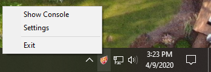

# IgniteBot

Program to pull and send player stats from EchoVR to a database.

*Authors: VTSxKING and NtsFranz*

## Development environment setup
 - Visual Studio 2019
 - We are using Advanced Installer to create the installer package. The program won't compile without these two things installed:
    - The Advanced Installer desktop client: https://www.advancedinstaller.com/download.html
    - The Advanced Installer Visual Studio extension:
      - In Visual Studio, `Extensions`->`Manage Extensions`, then install `Advanced Installer for Visual Studio 2019` and restart VS.
    - When building the solution, the installer .msi is added to `[basefolder]\IgniteBotInstaller\IgniteBotInstaller-SetupFiles\IgniteBotInstaller.msi`
   

## Usage
 - Main control of the program can be found in the tray icon  
   
 - `Settings` - Shows the UI to modify settings
   - Settings are saved across app launches
   - Enabling `Stats Logging` records stats and events during the match.
   - Enabling `Full Logging` records all data (positional and stats) from the EchoVR API at a chosen update rate and saves it to a file.

***Note: In the event of a network issue with database connection all data is written locally and is also sent to Ignite
Servers. You may recover/locate data and error logs at `IgniteBot\Log`***
